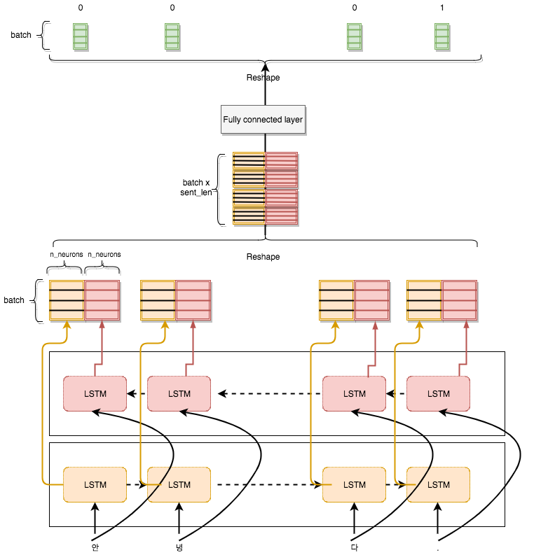

## KoWordSpacing

- Korean Word Spacing with bidirectional LSTM and Linear CRF. 

### Requirement(R package) 

- `tensorflow`
- `hashmap`
- `wordVectors`
- `caret`
- `stringr`
- `stringi`
- `data.table`
- `reshape2`

- Detail was dicussed on [this blog link(Korean)](http://freesearch.pe.kr/archives/4617).

